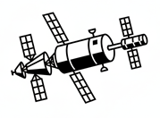

# SQAAILab
> _Software Quality Assurance & Artificial Intelligence Laboratory_

## Project Overview

This project explores how **Artificial Intelligence (AI)** can enhance **Software Quality Assurance (SQA)** practices.

Each subfolder focuses on a specific AI-driven approach. Please refer to the corresponding **README.md** file in each directory for detailed explanations, examples, and workflows.

🚀 **Vision:**   
The topics listed below represent the current areas of exploration. This repository is designed as a living laboratory for AI in Software Quality Assurance and will continuously evolve to experiment with, validate, and document emerging AI-driven techniques, tools, and paradigms as the field matures.

## Topics Covered

### 🔹 Vibe Coding
10-AI-vibe-coding

An AI-driven development approach where developers use natural language prompts to guide Generative AI models (such as LLMs) to generate, refine, and debug code.

### 🔹 Reverse Documentation
15-AI-doc-generation

An analytical approach that leverages existing source code to recreate missing, outdated, or undocumented specifications.

### 🔹 Generative BDD
20-AI-QA-analysis-assistant

An AI-assisted approach to **Behavior-Driven Development (BDD)** that automates the generation of BDD scenarios, step definitions, and test scripts. Natural language requirements are transformed into structured **Gherkin (Given–When–Then)** syntax, helping to improve test coverage, reduce manual effort, and increase consistency across the software development lifecycle.

### 🔹 AI-Generated Test Design  
20-AI-QA-analysis-assistant

Automatically deriving test cases, edge cases, and exploratory testing ideas from source code, user stories, APIs, and system behavior.

### 🔹 Vibe Coding Tests  
25-AI-vibe-coding-tests

This is the major trend right now. Instead of worrying about strict code syntax, the tester focuses on the intent (the "vibe") and lets AI (like LLMs) generate the automation code. This makes it possible to create complex tests suites simply by describing the scenario in natural language.

---
## 🔮 Future Areas of Exploration

As this project evolves, it aims to explore a broader range of AI-driven capabilities across the Software Quality Assurance lifecycle, including (but not limited to):

### 🔹 LLM RAG
"Large Language Model" with "Retrieval-Augmented Generation" - Consulting an authoritative knowledge base external to the AI ​​training data before generating a response using specific or sensitive information such as local documents, databases, web pages, personal notes, etc.

### 🔹 Intelligent Test Data Generation  
Creating realistic, compliant, and scenario-focused test data using Generative AI and synthetic data techniques.

### 🔹 AI-Assisted Bug Detection & Root Cause Analysis  
Leveraging AI to analyze logs, traces, test results, and code changes to proactively identify defects and suggest probable root causes.

### 🔹 Self-Healing Test Automation  
Using AI to detect UI and API changes and automatically adapt test scripts to reduce maintenance costs.

### 🔹 Continuous Quality Monitoring (QA Ops)  
Applying AI to monitor quality signals in CI/CD pipelines, production environments, and user feedback loops.

### 🔹 Predictive Quality & Risk Analysis  
Forecasting quality risks, regression impact, and release readiness based on historical data, code changes, and system complexity.

### 🔹 AI-Driven Code Review & Quality Gates  
Enhancing static analysis and code reviews with AI-powered insights focused on quality, testability, and maintainability.  

### 🔹 Living Documentation & Knowledge Extraction  
Continuously generating and updating technical and functional documentation directly from evolving codebases and system behavior.  
